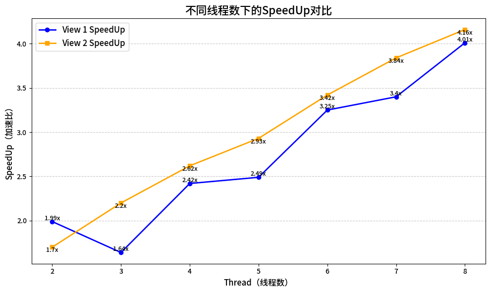

# speedup rate

| Thread |  View 1 SpeedUp | View 2 SpeedUp|
|:-------:|:-------:|:------:|
| 2      | 1.99x   | 1.70x |
| 3      | 1.64x   | 2.20x |
| 4      | 2.42x   | 2.62x |
| 5      | 2.49x   | 2.93x |
| 6      | 3.25x   | 3.42x |
| 7      | 3.40x   | 3.84x |
| 8      | 4.01x   | 4.16x |

# Why not linear
推测没有完全线性关系原因 -> 任务分配不合理，任务开销不是根据图中的空间均匀分布

各个Thread耗时结果

| Thread | View 1 (多次测试值)         | View 2 (多次测试值)         |
| :----: | :-------------------------: | :-------------------------: |
| 2      | **0.282412**, 0.280704         | 0.198987, 0.139560         |
| 3      | 0.110937, **0.349868**, 0.119900 | 0.156499, 0.105302, 0.088434 |
| 4      | 0.059508, 0.230299, 0.231722, 0.051986 | 0.130572, 0.073132, 0.077614, 0.067313 |
| 5      | 0.028505, 0.145826, 0.225857, 0.145323, 0.023427 | 0.130651, 0.072959, 0.078302, 0.084676, 0.068333 |
| 6      | 0.014979, 0.104297, 0.172861, 0.176950, 0.094990, 0.017160 | 0.099500, 0.057569, 0.047530, 0.053718, 0.051111, 0.041665 |
| 7      | 0.011832, 0.070315, 0.129736, 0.169031, 0.124769, 0.069208, 0.013327 | 0.086251, 0.054450, 0.041077, 0.048702, 0.042535, 0.046054, 0.037975 |
| 8      | 0.011463, 0.051899, 0.101804, 0.147668, 0.148801, 0.102770, 0.049655, 0.010059 | 0.079211, 0.052312, 0.037932, 0.040456, 0.042103, 0.037213, 0.042929, 0.030865 |

# Modify Mapping

Mandelbrot集合，负平面的每个点逃逸速度不同，逃逸越慢，最终ppm越亮
为获得8核心，7-8x的speedup，需要将计算任务均匀划分为8份
Key Insight：每个点计算独立
参考https://www.cnblogs.com/kalicener/p/16824312.html 把每个点shuffle到不同的线程

要改太多代码，实现略
16线程如果有独立的核心线程，应该就有理想加速比，如果没有，应该和8线程区别不大