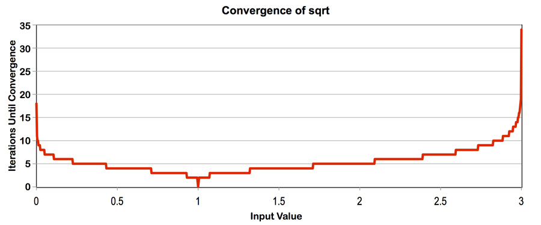

# 原始加速
   
```
(4.04x speedup from ISPC) // AVX2 32*8
(29.42x speedup from task ISPC) // 64 Task
(29.13x speedup from task ISPC) // 8 Task
```

- AVX256位长，对于float（4byte），理论极限是8倍性能提升
- 八个核心，理论上限 8*8倍

Value是0-3之间的随机数

划分方式：按照Task数量均分  Value Array

计算复杂度：


可以看到，复杂度不均匀，AVX内部存在等待，因此AVX不是8x，而是4x
随机选取，Task的计算复杂度理论上差不多，实际上Task达到了大概8x（八个核心），符合预期

# 

    